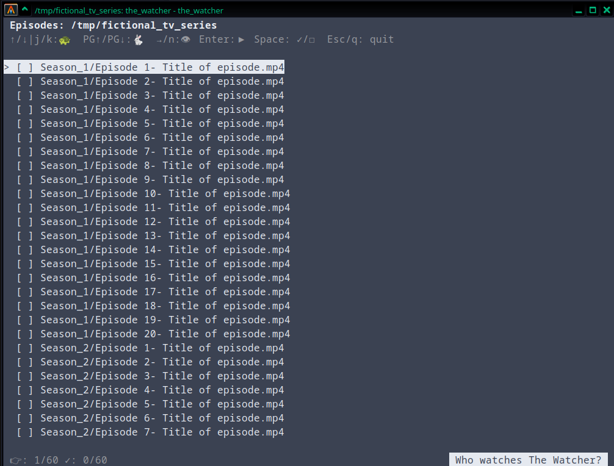

# the_watcher

A small terminal user interface for tracking watched episodes in a directory.

`the_watcher` recursively scans a series directory, displays its video files in natural folder and filename order, highlights the next unwatched episode, and lets you launch episodes in your preferred media player.

It is intentionally simple: there is no server, web interface, account, metadata database, or background process.

[](https://github.com/mudhairless/the_watcher/actions/workflows/pylint.yml)

<p align="center">
  
  <br>
  <em>The Watcher running in alacritty</em>
</p>


## Features

- Terminal-based interface
- Recursively scans subdirectories
- Natural sorting for folders and filenames
- Highlights the next unwatched episode on startup
- Opens selected episodes in a configurable media player
- Marks episodes watched or unwatched with one keypress
- Stores watch history locally in a JSON file
- Detects renamed files when the file remains on the same filesystem
- KDE Dolphin service-menu integration
- GNOME Nautilus Scripts menu integration
- Optional support for other file managers through their script/action systems

## Requirements

- Linux
- Python 3.10 or later
- A terminal
- A media player such as `mpv`, `vlc`, or `mplayer`

The Python program uses only modules from the standard library.

## Installation

The repository contains these files:

```text
the_watcher/
├── the_watcher.py
├── the_watcher_terminal_select.sh
├── the_watcher.desktop
└── manager.sh
└── LICENSE.md
└── README.md
```

Make the manager executable if :

```bash
chmod +x manager.sh
```

Install the program:

```bash
./manager.sh install
```

This installs the main script, the terminal opener script and the KDE and GNOME integrations 
for the current user. It will create a .local/bin directory in your home folder if it does not
already exist and place the scripts there. You should add `$HOME/.local/bin` to your `$PATH`
variable to make using from a terminal easier. If you do you can leave off the `~/.local/bin/`
part of each command given below. Setting this up is easy but out of scope for this project,
just search "Add directory to $PATH linux" and you should be good.


To uninstall:

```bash
./manager uninstall
```

To display the manager’s help:

```bash
./manager help
```

This will also tell you if stuff is installed.

## Running from a terminal

Run the program by passing it a directory:

```bash
~/.local/bin/the_watcher /home/user/video/series_a
```

For example:

```bash
~/.local/bin/the_watcher "$HOME/Videos/Star Trek"
```

You can also navigate to the folder containing your series and run `~/.local/bin/the_watcher` and it should detect
the current directory. 

The directory can contain files directly or use nested season folders:

```text
series_a/
├── Season 01/
│   ├── Episode 01.mkv
│   └── Episode 02.mkv
└── Season 02/
    ├── Episode 01.mkv
    └── Episode 02.mkv
```

Supported video extensions include:

```text
    .3gp
    .avi
    .asf
    .divx
    .flv
    .m2ts
    .m4v
    .mkv
    .mov
    .mp4
    .mpeg
    .mpg
    .mts
    .ogm
    .ogv
    .rm
    .rmvb
    .ts
    .webm
    .wmv
    .vob
```

## Controls

| Key | Action |
|---|---|
| `↑` / `k` | Move up |
| `↓` / `j` | Move down |
| `PgUp` | Move Up by 10 |
| `PgDown` | Move Down by 10 |
| `Home` | Go to the first episode |
| `End` | Go to the last episode |
| `n` / `→` | Seek to the next unwatched episode |
| `Enter` | Open the selected episode |
| `Space` | Toggle watched status |
| `Esc` / `q` | Quit |

The program starts with the first unwatched episode selected. If every episode is watched, it starts at the first episode.

## Media player configuration

The default player is `vlc`.

To use mpv:

```bash
PLAYER=mpv ~/.local/bin/the_watcher "$HOME/Videos/series_a"
```

To use fullscreen mpv:

```bash
PLAYER="mpv --fullscreen" \
    ~/.local/bin/the_watcher "$HOME/Videos/series_a"
```

To persist the selected player simply add the PLAYER variable to your shell's configuration file.

The `the_watcher_terminal_select` launcher first tries `xdg-terminal-exec`, allowing the desktop’s configured terminal to be used. It falls back to common terminal programs if necessary. This is used by the KDE and GNOME
integrations to launch your configured terminal.

## Watch-history database

A database is created inside each tracked directory:

```text
series_a/.episode_watches.json
```

The file contains relative paths, watched states, and file identity information used for rename detection.

Example:

```json
{
  "files": {
    "Season 01/Episode 01.mkv": {
      "watched": true,
      "identity": {
        "device": 2049,
        "inode": 123456,
        "size": 734003200
      }
    }
  }
}
```

The database is separate for every directory passed to the program.

## Rename detection

When the program starts, it compares files with the previous database.

If a file has been renamed on the same filesystem, its device and inode normally remain unchanged. `the_watcher` uses this information, along with the file size, to transfer the watched state to the new path.

For example:

```text
Season 01/Episode 03.mkv
```

renamed to:

```text
Season 01/Episode 03 - Extended.mkv
```

will normally retain its watched state.

Rename detection does not reliably work when:

- The file is copied instead of renamed
- The file is moved to a different filesystem
- The file is replaced with a different file of the same name
- The file’s identity information is unavailable

## KDE Dolphin integration

After installation, KDE Dolphin should show a **Track watched episodes here** action when you right-click a directory (or empty space inside a directory).

The service menu is installed at:

```text
~/.local/share/kio/servicemenus/the_watcher.desktop
```

If it does not appear immediately, restart Dolphin.

### GNOME Files Integration

After installation, GNOME Files should show a **Track watched episodes here** item in the Scripts submenu when you right click a directory. You may need to restart Files for the entry to show up.

### Other desktops

Equivalent integrations can be created using the file manager’s custom-action or script system. The common launcher remains:

```text
~/.local/bin/the_watcher_terminal_select $folderPath
```

## Troubleshooting

### The program does not start

Try running it directly with Python:

```bash
python3 ~/.local/bin/the_watcher "$HOME/Videos/series_a"
```

### The media player is not found

Check the configured player:

```bash
echo "$PLAYER"
```

Or explicitly select one:

```bash
PLAYER=mpv ~/.local/bin/episodes.py "$HOME/Videos/series_a"
```

### Dolphin does not show the action

Check that the service menu is executable:

```bash
chmod +x ~/.local/share/kio/servicemenus/the_watcher.desktop
```

Then restart Dolphin.

### A directory contains no episodes

Check that the files use one of the supported extensions and that the directory is readable:

```bash
find "$HOME/Videos/series_a" -type f
```

## License
```
Copyright © 2026 Ebben Feagan

Permission is hereby granted, free of charge, to any person
obtaining a copy of this software and associated documentation
files (the “Software”), to deal in the Software without
restriction, including without limitation the rights to use,
copy, modify, merge, publish, distribute, sublicense, and/or sell
copies of the Software, and to permit persons to whom the
Software is furnished to do so, subject to the following
conditions:

The above copyright notice and this permission notice shall be
included in all copies or substantial portions of the Software.

THE SOFTWARE IS PROVIDED “AS IS”, WITHOUT WARRANTY OF ANY KIND,
EXPRESS OR IMPLIED, INCLUDING BUT NOT LIMITED TO THE WARRANTIES
OF MERCHANTABILITY, FITNESS FOR A PARTICULAR PURPOSE AND
NONINFRINGEMENT. IN NO EVENT SHALL THE AUTHORS OR COPYRIGHT
HOLDERS BE LIABLE FOR ANY CLAIM, DAMAGES OR OTHER LIABILITY,
WHETHER IN AN ACTION OF CONTRACT, TORT OR OTHERWISE, ARISING
FROM, OUT OF OR IN CONNECTION WITH THE SOFTWARE OR THE USE OR
OTHER DEALINGS IN THE SOFTWARE.
```
